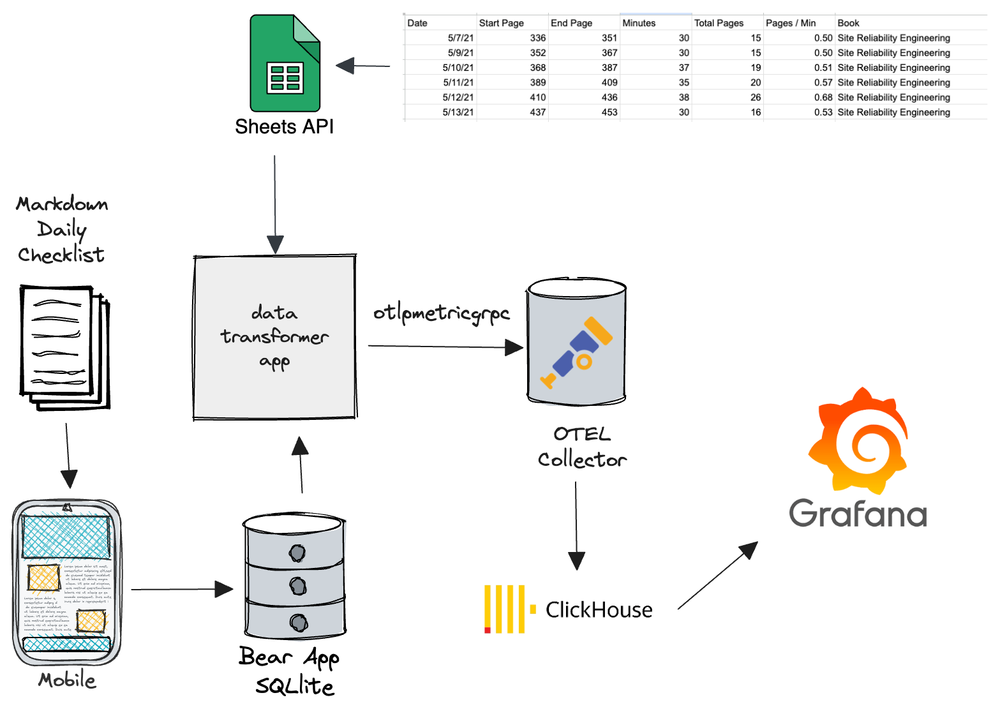
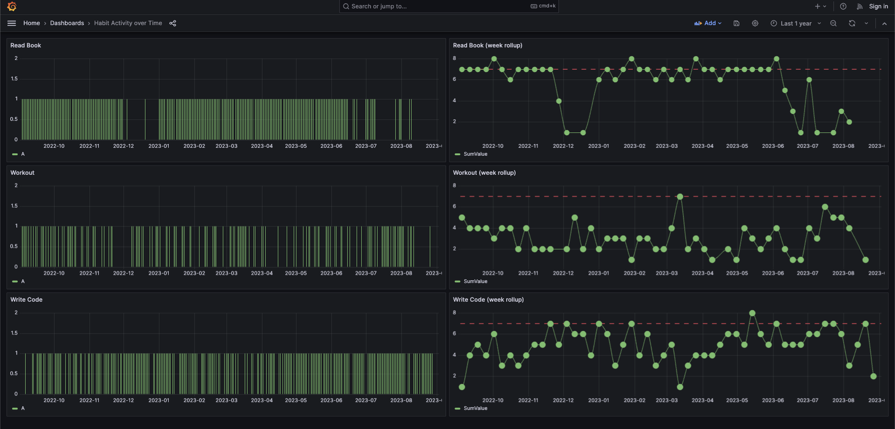

# OTEL Habits

Pull daily checklists in Markdown format from Bear note app, convert to OTel Metric format, submit to collector, export 
to data store (clickhouse), visualize in grafana.




It takes the checklists in the format:

```markdown
# 2023-09-04

## Daily Routine
- [ ] Read Book
- [ ] Italian
- [ ] Walk Dog
- [ ] Write Code
- [ ] Workout
```

and converts it to metrics which can be viewed in Grafana:




# Setup

You will need to set an ENV var on application to point at the collector:

`OTEL_EXPORTER_OTLP_METRICS_ENDPOINT=http://localhost:4317`


```bash
# Startup Clickhouse DB, OTEL collector, Grafana, and run app
docker compose up -d

# or
make docker

# Make a copy of the Bear App SQLlite db
make importdb

# Run App to pull data and submit to collector
make run

# Re-import db and reset everything
make docker-reset
```


## Clickhouse

Queries

Jump on the clickhouse box and use the `clickhouse-client` binary to login and interact:

```sql
/* show database list */
SHOW DATABASES;

/* identify all tables */
SELECT
    table,
    sum(rows) AS rows,
    max(modification_time) AS latest_modification,
    formatReadableSize(sum(bytes)) AS data_size,
    formatReadableSize(sum(primary_key_bytes_in_memory)) AS primary_keys_size,
    any(engine) AS engine,
    sum(bytes) AS bytes_size
FROM clusterAllReplicas(default, system.parts)
WHERE active
GROUP BY
    database,
    table
ORDER BY bytes_size DESC;

/* See schema */
SHOW CREATE TABLE otel.otel_metrics_sum

/* Query all*/
SELECT MetricName, Attributes, StartTimeUnix, Value FROM otel.otel_metrics_sum;


/* Time series habit rolled up per week */
SELECT
    MetricName,
    Attributes,
    toStartOfWeek(StartTimeUnix) AS WeekStart,
    sum(Value) AS SumValue
FROM otel.otel_metrics_sum
WHERE Attributes = '{\'name\':\'Italian\'}'
GROUP BY  MetricName, Attributes, WeekStart
ORDER BY WeekStart DESC;

/* Time series habit full */
SELECT
    MetricName,
    Attributes,
    StartTimeUnix,
    Value
FROM otel.otel_metrics_sum
WHERE Attributes = '{\'name\':\'Read Book\'}'
ORDER BY StartTimeUnix DESC;
```