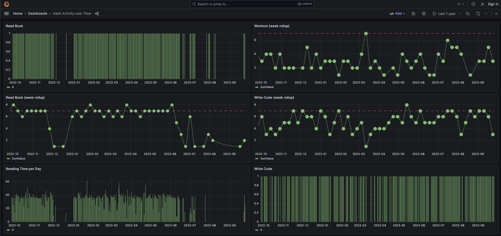

# OTel Habits

The goal is to pull some data associated with some habits I'm tracking in various formats, convert them into OTel metrics 
and visualize them in grafana.

Will use clickhouse as the metric data store.


## Habits

Daily habits are tracked with the [Bear note app](https://bear.app/) in the format:

```markdown
# 2023-09-04

## Daily Routine
- [ ] Read Book
- [x] Italian
- [ ] Walk Dog
- [ ] Write Code
- [ ] Workout
```

## Reading

Reading data is tracked in a google sheet with the format:

| Date    | Start Page | End Page | Minutes | Total Pages | Pages / Min | Book                         |
|---------|------------|----------|---------|-------------|-------------|------------------------------|
| 5/7/21  | 336        | 351      | 30      | 15          | 0.50        | Site Reliability Engineering |
| 5/9/21  | 352        | 367      | 30      | 15          | 0.50        | Site Reliability Engineering |
| 5/10/21 | 368        | 387      | 37      | 19          | 0.51        | Site Reliability Engineering |
| 5/11/21 | 389        | 409      | 35      | 20          | 0.57        | Site Reliability Engineering |
| 5/12/21 | 410        | 436      | 38      | 26          | 0.68        | Site Reliability Engineering |
| 5/13/21 | 437        | 453      | 30      | 16          | 0.53        | Site Reliability Engineering |


## Output 

The data is turned into timeseries and can then be viewed in [Grafana](http://localhost:3001/) with a pre-created dashboard:




# Setup

You will need to set an ENV var on application to point at the collector:

`OTEL_EXPORTER_OTLP_METRICS_ENDPOINT=http://localhost:4317`


```bash
# Startup Clickhouse DB, OTEL collector, Grafana, and run app
docker compose up -d

# or
make docker

# Make a copy of the Bear App SQLlite db
make importdb

# Run App to pull models and submit to collector
make run

# Re-import db and reset everything
make docker-reset
```


## Google sheets

Needed to create a service account, download the secret and add it to this repo as `secret.json`, and then invite the
service account's email address to collaborate on the document.


## Clickhouse

Queries

Jump on the clickhouse box and use the `clickhouse-client` binary to login and interact:

```sql
/* show database list */
SHOW DATABASES;

/* identify all tables */
SELECT
    table,
    sum(rows) AS rows,
    max(modification_time) AS latest_modification,
    formatReadableSize(sum(bytes)) AS data_size,
    formatReadableSize(sum(primary_key_bytes_in_memory)) AS primary_keys_size,
    any(engine) AS engine,
    sum(bytes) AS bytes_size
FROM clusterAllReplicas(default, system.parts)
WHERE active
GROUP BY
    database,
    table
ORDER BY bytes_size DESC;

/* See schema */
SHOW CREATE TABLE otel.otel_metrics_sum

/* Query all*/
SELECT MetricName, Attributes, StartTimeUnix, Value FROM otel.otel_metrics_sum;


/* Time series habit rolled up per week */
SELECT
    MetricName,
    Attributes,
    toStartOfWeek(StartTimeUnix) AS WeekStart,
    sum(Value) AS SumValue
FROM otel.otel_metrics_sum
WHERE Attributes = '{\'name\':\'Italian\'}'
GROUP BY  MetricName, Attributes, WeekStart
ORDER BY WeekStart DESC;

/* Time series habit full */
SELECT
    MetricName,
    Attributes,
    StartTimeUnix,
    Value
FROM otel.otel_metrics_sum
WHERE Attributes = '{\'name\':\'Read Book\'}'
ORDER BY StartTimeUnix DESC;
```